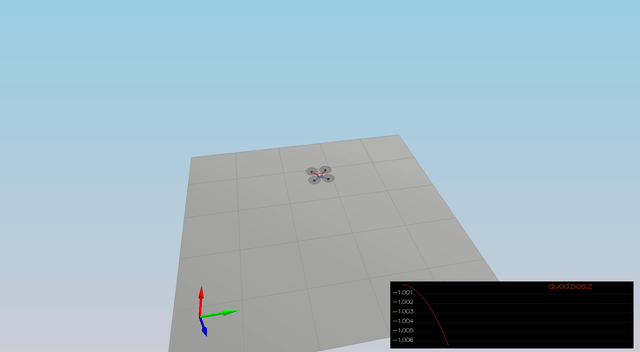
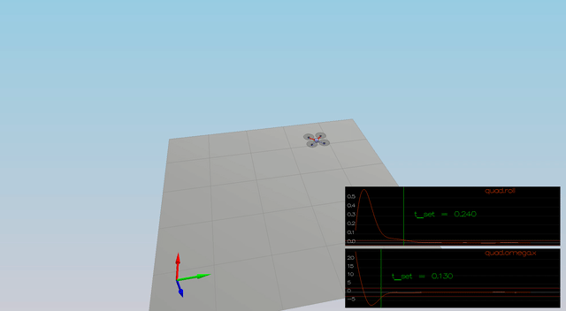
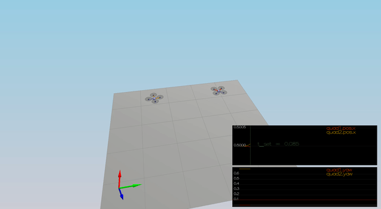
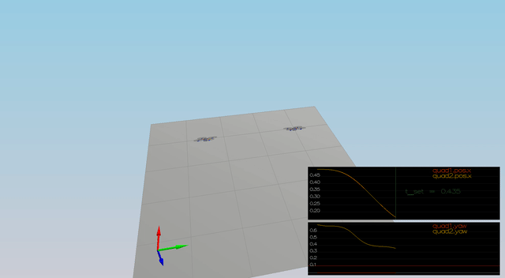
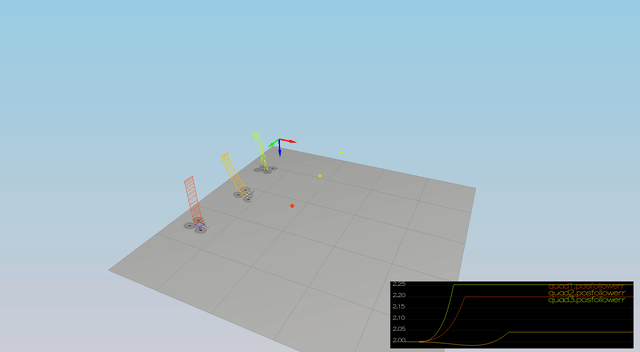
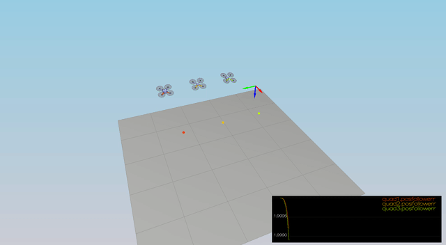
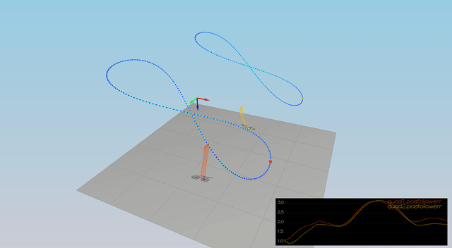
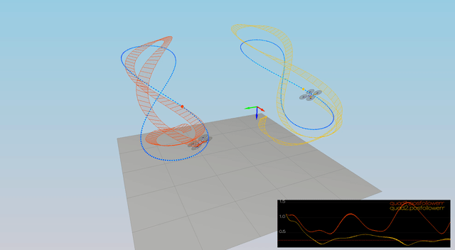

# Scenario 1: Wrong model (mass) correction

Before:

After:

# Scenario 2 Body rates & roll/pitch control

The vehicle recovers from roll axis rotation 

Before:

After:

# Scenario 3: Lateral control

The vehicle corrects the initial yaw error, and converges to it's target X position.

Before:

After:

# Scenario 4: Non-idealities & robustness

The two vehicles:
- with offset center of gravity
- with larger mass

converge to their set X positions.

Before:

After:

# Scenario 5: Tracking trajectories

The vehicle is able to track "figure 8" trajectory within the set error margin.

Before:

After:

